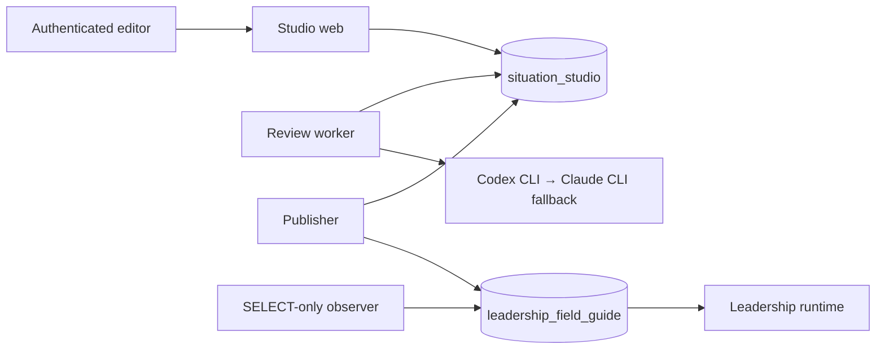

# Situation Studio architecture

Situation Studio is a three-process editorial workbench backed by an
independent PostgreSQL database named `situation_studio`. The separate
`leadership_field_guide` database remains the only public content authority.

## Authority and credentials

| Process            | Studio authority                                    | Leadership authority                                             | Other secrets           |
| ------------------ | --------------------------------------------------- | ---------------------------------------------------------------- | ----------------------- |
| Web                | accounts, sessions, drafts, checkouts, user actions | none                                                             | session, CSRF, throttle |
| Review worker      | review queue, runs, evidence, proposals             | none                                                             | isolated CLI auth state |
| Publisher          | publication jobs, receipts, production history      | SELECT plus restricted append/validate/promote/restore functions | Leadership health URL   |
| Observer/bootstrap | imported observations and history                   | SELECT only                                                      | none                    |

Production startup uses a clean environment for each process and sources one
mode-0400/0600 file. Subscription CLI auth is owned by the dedicated review
user; it cannot reach the publisher. Leadership publisher credentials cannot
reach the web or review worker.

## Data and lifecycle

Content bodies are canonicalized and addressed by SHA-256. Draft revisions,
review evidence, production occurrences, publication events, verification
receipts, and audit events are append-only. Production occurrences may refer to
the same content hash—such as a restoration—but are unique per Leadership
release observation, preserving forward history and provenance while content
blobs remain deduplicated.

Only one active checkout can exist per situation. Every mutation supplies the
checkout ID and monotonically increasing fence. Checkouts never time out.
Force-check-in releases ownership, records the resulting draft hash, cancels
review work, and makes late results fail their fence.

The visible status is derived from facts (`Available`, `Draft saved`, `Checked
out by …`, or `Retired`) plus temporary activity. There is no editorial state
machine, approval queue, staging site, or candidate runtime.

## Review

The review worker claims one global job with `FOR UPDATE SKIP LOCKED` and
persists all 24 stages: graph mapping, seven critics, a mediated issue register,
seven rebuttals, adjudication, teaching design, one consolidated proposal, four
independent audits, and deterministic validation.
Every run records requested and resolved provider/model/effort, evidence and
output hashes, strict structured output, usage, and failure classification.
Codex is preferred and Claude is the provider-scoped fallback. Proposals never
alter a draft until the editor accepts a change.

Review substance comes from a committed, hash-versioned snapshot of the
`review-leadership-situations` skill in `packages/review-policy/policy`.
`pnpm review-policy:sync` refreshes that snapshot from the authored local skill;
`pnpm review-policy:check` verifies every packaged file and detects source drift
when the authored skill is available. Production uses only the committed
snapshot, and each review job pins its exact review-policy version.

An explicitly retryable provider failure returns the job to `QUEUED` at its
first incomplete stage for two bounded automatic retries. The persisted
not-before timestamp survives worker restarts, while the global running slot is
available to other due work. Every attempt remains an immutable `AgentRun`,
including bounded per-provider duration, safe outcome, and failure-class
metadata. System retry audits contain no provider output or error text.

### Live review status

The authenticated workspace opens
`GET /api/reviews/:reviewJobId/events` only while its displayed review is
`QUEUED` or `RUNNING`. This Node-runtime route is a read-only, same-origin
Server-Sent Events stream. It uses the ordinary session cookie and does not
change mutation CSRF handling.

PostgreSQL remains authoritative. A connection receives one complete
`review-status-v2` snapshot immediately, including the job state, exact
completed/total counts, the 24 bounded stage states, a safe human-readable
current stage, attempt and durable retry information when applicable, terminal
state, proposal readiness, and a deterministic SHA-256 snapshot identity.
The public Zod schema rejects unknown structure at runtime. It cannot contain
prompts, evidence, provider output, raw errors, secrets, logs, lease claims, or
fencing tokens.

The route queries the compact status projection every 1.5 seconds and emits a
new event only when the deterministic safe snapshot identity changes. A
15-second comment heartbeat keeps an idle provider call visible to
intermediaries without causing a client update. A terminal snapshot closes the
stream. Non-terminal streams also close after two minutes so native
`EventSource` reconnects with a fresh authenticated request and another full
snapshot; `Last-Event-ID` is never treated as state. Request abort, response
cancellation, missing jobs, validation failures, and database errors clear
timers and stop the stream without exposing the underlying error.

The browser keys every event to both the displayed review ID and a local
connection generation, so an old review or superseded connection cannot update
the workspace. A disconnect shows a quiet reconnecting state while the durable
worker continues independently. Terminal state schedules exactly one server
refresh, after a short reduced-motion-aware completion transition, to load the
full proposal and authoritative controls. Heartbeats and countdown ticks do not
enter the polite live region.

## Publication and recovery

The publisher:

1. pins the saved revision and compares its base bundle with the current
   Leadership target;
2. rebases automatically when only unrelated content changed;
3. persists a complete canonical candidate snapshot in Studio;
4. inserts, validates, and promotes one complete immutable Leadership release
   inside an expected-generation transaction;
5. verifies the database and running Leadership application report the exact
   release ID and manifest hash;
6. records the Studio production occurrence and receipt, then checks in.

Retries reconcile by Studio publication ID, Leadership release ID, manifest
hash, and pointer generation. If runtime verification fails after promotion,
the publisher restores and verifies the prior full release. Failed restoration
sets the global `RECOVERY_REQUIRED` fence.

Creation changes `UNPUBLISHED` drafts to a canonical public production bundle.
Retirement retains content but marks the release-scoped typed situation
`RETIRED`, removes promotion output, and relies on Leadership’s public
visibility filters. Restoration copies one historical situation bundle into a
new draft but publishes it over the newest complete release, leaving unrelated
content unchanged.

## Operations

Encrypted backups use custom-format `pg_dump`, GPG recipient encryption,
SHA-256 receipts, mode-0600 storage, and a disposable-database restore drill.
Health surfaces expose liveness, database readiness, queue state, process
heartbeats, backup age, and recovery fencing without exposing secrets or
internal publication steps to editors.

The schema and transition detail is in
[checkpoint 1](checkpoints/01-contract-and-data-model.md). Production remains
behind the separate approval procedure in
[the migration runbook](runbooks/production-migration.md).
