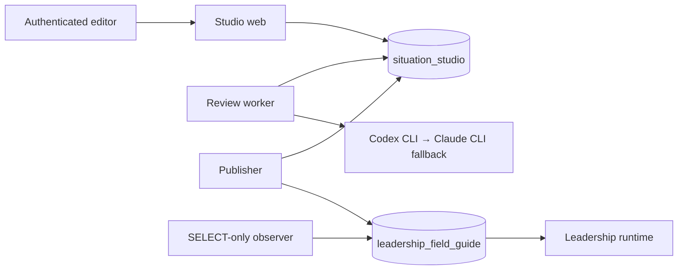

# Situation Studio architecture

Situation Studio is a three-process editorial workbench backed by an
independent PostgreSQL database named `situation_studio`. The separate
`leadership_field_guide` database remains the only public content authority.

## Authority and credentials

| Process            | Studio authority                                    | Leadership authority                                             | Other secrets           |
| ------------------ | --------------------------------------------------- | ---------------------------------------------------------------- | ----------------------- |
| Web                | accounts, sessions, drafts, checkouts, user actions | none                                                             | session, CSRF, throttle |
| Review worker      | review queue, runs, evidence, proposals             | none                                                             | isolated CLI auth state |
| Publisher          | publication jobs, receipts, production history      | SELECT plus restricted append/validate/promote/restore functions | Leadership health URL   |
| Observer/bootstrap | imported observations and history                   | SELECT only                                                      | none                    |

Production startup uses a clean environment for each process and sources one
mode-0400/0600 file. Subscription CLI auth is owned by the dedicated review
user; it cannot reach the publisher. Leadership publisher credentials cannot
reach the web or review worker.

## Data and lifecycle

Content bodies are canonicalized and addressed by SHA-256. Draft revisions,
review evidence, production occurrences, publication events, verification
receipts, and audit events are append-only. Production occurrences may refer to
the same content hash—such as a restoration—but are unique per Leadership
release observation, preserving forward history and provenance while content
blobs remain deduplicated.

Only one active checkout can exist per situation. Every mutation supplies the
checkout ID and monotonically increasing fence. Checkouts never time out.
Force-check-in releases ownership, records the resulting draft hash, cancels
review work, and makes late results fail their fence.

The visible status is derived from facts (`Available`, `Draft saved`, `Checked
out by …`, or `Retired`) plus temporary activity. There is no editorial state
machine, approval queue, staging site, or candidate runtime.

## Review

The review worker claims one global job with `FOR UPDATE SKIP LOCKED` and
persists all 24 stages: graph mapping, seven critics, a mediated issue register,
seven rebuttals, adjudication, teaching design, one consolidated proposal, four
independent audits, and deterministic validation.
Every run records requested and resolved provider/model/effort, evidence and
output hashes, strict structured output, usage, and failure classification.
Codex is preferred and Claude is the provider-scoped fallback. Proposals never
alter a draft until the editor accepts a change.

Review substance comes from a committed, hash-versioned snapshot of the
`review-leadership-situations` skill in `packages/review-policy/policy`.
`pnpm review-policy:sync` refreshes that snapshot from the authored local skill;
`pnpm review-policy:check` verifies every packaged file and detects source drift
when the authored skill is available. Production uses only the committed
snapshot, and each review job pins its exact review-policy version.

An explicitly retryable provider failure returns the job to `QUEUED` at its
first incomplete stage for two bounded automatic retries. The persisted
not-before timestamp survives worker restarts. A durable focused-lane marker
keeps that review ahead of every later job during backoff. A terminal failure
also retains the lane until the editor retries the review, stops it, or closes
the checkout. Retrying a historical failed review atomically makes that exact
retained job the lane owner; a different existing owner produces a conflict
instead of silently queueing the selected retry. Every attempt remains an
immutable `AgentRun`, including bounded
per-provider duration, safe outcome, and failure-class metadata. System failure
and retry audits contain bounded reason codes, stage and phase details, and no
provider output or raw error text.

### Live review status

The authenticated workspace opens
`GET /api/reviews/:reviewJobId/events` only while its displayed review is
`QUEUED` or `RUNNING`. This Node-runtime route is a read-only, same-origin
Server-Sent Events stream. It uses the ordinary session cookie and does not
change mutation CSRF handling.

PostgreSQL remains authoritative. A connection receives one complete
`review-status-v3` snapshot immediately, including the job state, focused or
waiting lane state, exact
completed/total counts, the 24 bounded stage states, a safe human-readable
current stage, attempt and durable retry information when applicable, a fixed
safe explanation of the latest failure, terminal state, proposal readiness,
and a deterministic SHA-256 snapshot identity.
The public Zod schema rejects unknown structure at runtime. It cannot contain
prompts, evidence, provider output, raw errors, secrets, logs, lease claims, or
fencing tokens.

The route queries the compact status projection every 1.5 seconds and emits a
new event only when the deterministic safe snapshot identity changes. A
15-second comment heartbeat keeps an idle provider call visible to
intermediaries without causing a client update. A terminal snapshot closes the
stream. Non-terminal streams also close after two minutes so native
`EventSource` reconnects with a fresh authenticated request and another full
snapshot; `Last-Event-ID` is never treated as state. Request abort, response
cancellation, missing jobs, validation failures, and database errors clear
timers and stop the stream without exposing the underlying error.

The browser keys every event to both the displayed review ID and a local
connection generation, so an old review or superseded connection cannot update
the workspace. A disconnect shows a quiet reconnecting state while the durable
worker continues independently. Terminal state schedules exactly one server
refresh, after a short reduced-motion-aware completion transition, to load the
full proposal and authoritative controls. Heartbeats and countdown ticks do not
enter the polite live region.

## Publication and recovery

The publisher:

1. pins the saved revision and compares its base bundle with the current
   Leadership target;
2. rebases automatically when only unrelated content changed;
3. persists a complete canonical candidate snapshot in Studio;
4. validates the complete manifest and exact candidate bodies with the same
   canonical content contract used by Leadership, before production changes;
5. inserts, validates, and promotes one complete immutable Leadership release
   inside an expected-generation transaction;
6. verifies within a bounded convergence window that the database and running
   Leadership application report the exact release ID and manifest hash, while
   renewing the publication lease and publisher heartbeat; and
7. records the Studio production occurrence and receipt, then checks in.

Retries reconcile by Studio publication ID, Leadership release ID, manifest
hash, and pointer generation. If runtime verification fails after promotion,
the publisher restores and verifies the prior full release. Failed restoration
sets the global `RECOVERY_REQUIRED` fence. While that fence exists, Studio
allows inspection of saved work but rejects new situations, new checkouts, and
editorial mutations across every workspace until publisher reconciliation
verifies a known Leadership release.

Before a reclaimed job starts another attempt, the publisher transactionally
marks any preserved unfinished attempt `PUBLISHER_PROCESS_INTERRUPTED` and then
creates the next numbered attempt. Connection setup is inside the same managed
failure boundary. Once promotion has been attempted, any error before the
candidate identity is authoritatively observed reloads the Studio job and
enters `RECOVERY_REQUIRED`; a lost Leadership commit acknowledgement can never
be downgraded to an ordinary terminal failure.

Publication claims and recovery-fence transitions share one PostgreSQL advisory
transaction lock, and only one unexpired publication owner can run globally.
Every authoritative transition compares the attempt's claim token and expected
state; a lease-lost worker exits without changing Studio or restoring
Leadership. While the separate Leadership release transaction assembles and
validates a candidate, a bounded heartbeat renews the Studio lease. The exact
claim, checkout, and situation fences are rechecked inside that transaction
immediately before pointer promotion and again immediately before commit; any
replacement claim rolls the Leadership transaction back. Success commits the
production occurrence, receipt, checkout and draft changes, terminal events,
and attempt evidence in one Studio transaction.
If that commit acknowledgement is lost, the publisher reloads the matching
receipt and keeps the candidate live. Automatic restoration first enters the
global recovery fence, so a crash after restoring Leadership is reconciled
instead of re-promoting the failed candidate.

Terminal events retain only a strictly bounded health source, reason, status,
attempt count, elapsed time, and observed immutable identity for the
editor-facing explanation. A `RECOVERY_REQUIRED` event keeps the original
live-verification detail separate from any retained automatic-restoration
failure detail and does not assert which release is live. Raw responses, URLs,
errors, headers, and stacks are never projected.

The read-only Leadership observer uses the same publication fence. It discards
an external snapshot if a publication is active, requires recovery, or starts
while that snapshot is being read, so an unverified or stale release cannot be
recorded as Studio production history.

Creation changes `UNPUBLISHED` drafts to a canonical public production bundle.
Retirement retains content but marks the release-scoped typed situation
`RETIRED`, removes promotion output, and relies on Leadership’s public
visibility filters. Restoration copies one historical situation bundle into a
new draft but publishes it over the newest complete release, leaving unrelated
content unchanged.

## Operations

Encrypted backups use custom-format `pg_dump`, GPG recipient encryption,
SHA-256 receipts, mode-0600 storage, and a disposable-database restore drill.
Health surfaces expose liveness, database readiness, queue state, process
heartbeats, backup age, and recovery fencing without exposing secrets or
internal publication steps to editors.

Publication requests recheck, inside their serializable transaction, that the
latest verified backup is complete, encrypted, carries a receipt-bound
attestation of checksum-verified off-site replication, is no more than 26 hours
old, and is paired with a restore drill on that exact complete receipt that
passed no more than 30 days ago and no earlier than the backup verification.
Missing, stale, unlinked, or materially future evidence pauses only production
submission and leaves saved editorial work available. Follow-up deployment independently requires the
protected backup operator environment, exact schedules, mandatory off-host
configuration, and the same evidence through a committed read-only database
policy query before creating a release. That query remains compatible with a
current release whose health response still reports the initial backup
deferral, while preflight independently requires the candidate's web
environment to switch to required mode. A genuine first-release preflight
instead proves that the candidate environment still uses the explicitly
approved deferred mode before any release is created. A one-time append-only transition can
attest a legacy worker receipt only after rechecking the exact object on the
currently configured off-site target; normal workers persist that binding
directly.

The backup queue first proves that the source and receipt URLs normalize to the
same host, port, and `situation_studio` database, then uses one
destination-scoped operating-system lock, marks abandoned `RUNNING` claims
failed before selecting new work, bounds database, dump, encryption, and
network commands, and records terminal state only through the exact claimed
receipt and start-time fence. Follow-up deployment independently repeats that
database-identity proof. Restore-drill recording uses the same receipt identity
and current destination binding, rechecks both local and remote checksum and
byte length, rejects an empty restored production dataset, and writes `PASSED`
or `FAILED` only if those facts remain unchanged. For the deferred-release transition, the recorder may
run from an approved candidate copy before cutover only when its bytes match a
separately supplied SHA-256; it still invokes the restore script from the
recorded immutable current release and reports both identities.

A follow-up deployment first quiesces web and review intake, waits for all
unfinished publication attempts to persist their terminal evidence, rejects a
recovery fence, and stops the publisher. Its
token-fenced atomic deployment lease serializes every remote mutation through
verification or rollback and fails closed on an existing or incomplete lease.
Before migration, one preclaimed receipt and append-only audit anchor bind the
approved release and active-review projection hashes to a new synchronous,
encrypted off-site backup. The exact artifact must decrypt and expose a valid
PostgreSQL custom-format catalog, its receipt must be verified after the
database-clock quiescence fence against the preflight-frozen destinations and
encryption-key fingerprint, and both projections must remain unchanged across
the dump. Its
`active-review-state-continuity-v2` receipt contains matching before/after
hashes for active checkout, draft, revision, and review state plus matching
expected/actual hashes for queue-time normalization and focused-lane ownership.
Cutover failure restores the exact previous immutable release and succeeds as a
rollback only after both local live and ready checks pass.

The schema and transition detail is in
[checkpoint 1](checkpoints/01-contract-and-data-model.md). Production remains
behind the separate approval procedure in
[the migration runbook](runbooks/production-migration.md).
