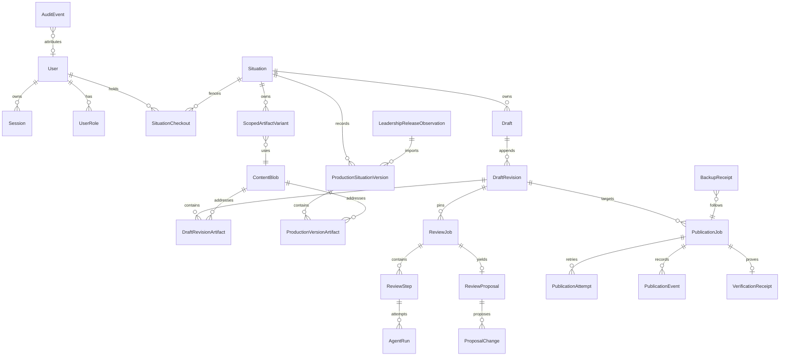

# Checkpoint 1 — Contract and data-model design

Status: accepted for local implementation on 2026-07-23.

The user authorized continuation through all local checkpoints. Production
migration, production data mutation, and deployment remain outside that
authorization because the governing spec requires a later procedure-specific
approval.

## Ground truth inspected

- Situation Studio starts from the intentionally reduced Next.js 16 / React 19
  tree. The existing deletions were not restored.
- Leadership is clean at commit `58e8634`.
- Leadership's initial PostgreSQL migration models immutable complete releases,
  a singleton `current_release` pointer, content-addressed artifact versions,
  release membership, edges, and typed projections.
- The production-shaped fixture contains 32 artifacts, 99 graph edges, 15
  situations, 3 guides, and 3 practices.
- Leadership owns `@leadership-field-guide/content-contracts` version `0.1.0`.
  Checkpoint 5 will extend and repack that artifact without moving ownership
  back to Studio.
- No Leadership database credential is present in the local workspace.
  Consequently the local work uses disposable PostgreSQL 16 databases and the
  checked-in production-shaped fixture. No production probe or write is
  attempted.

## Authority boundaries

```mermaid
flowchart LR
  Editor["Editor browser"] --> Web["Studio web role"]
  Web --> Studio[("situation_studio")]
  Worker["Review worker"] --> Studio
  Worker --> Providers["Codex CLI → Claude CLI fallback"]
  Publisher["Publisher"] --> Studio
  Observer["Read-only observer"] --> Leadership[("leadership_field_guide")]
  Publisher --> Leadership
  Leadership --> Public["Leadership runtime"]

  Web -. "no provider or Leadership write credential" .-> Boundary1[""]
  Worker -. "no Leadership write credential" .-> Boundary2[""]
  Publisher -. "no password, session, or provider credential" .-> Boundary3[""]
```

Leadership remains the only public production authority. Studio owns accounts,
working copies, review evidence, publisher jobs, and independent per-situation
history. Leadership never reads Studio while serving public content.

## Studio entity model



Content bytes are keyed by canonical SHA-256. Immutable revisions and
production-history records point at blobs and relationship manifests. Shared
artifact identities are copied only when a situation-owned edit is accepted.

## Situation bundle manifest

The bundle hash is SHA-256 over canonical JSON with object keys and collection
members in deterministic order. It includes:

- contract and validation policy versions;
- stable Studio situation ID and Leadership slug;
- lifecycle visibility;
- typed situation metadata and canonical MDX body hash;
- ordered relationship entries;
- promotion metadata owned by the situation;
- each owned scoped variant's type, logical ID, original logical ID, original
  base hash, content hash, visibility, and owner;
- review-context hashes for referenced shared artifacts.

The bundle excludes transient checkout, review, user-interface, and publisher
state. Two site-wide releases that resolve to the same bundle hash for a
situation produce one Studio production-history entry.

## Derived status

| Facts                                              | Primary status           | Activity                                      |
| -------------------------------------------------- | ------------------------ | --------------------------------------------- |
| public, no checkout, draft equals production       | Available                | none                                          |
| public, no checkout, draft differs                 | Draft saved              | none                                          |
| checkout held                                      | Checked out by `<user>`  | optional review/publish badge                 |
| not public                                         | Retired                  | optional review/publish badge                 |
| target production bundle changed since draft base  | primary status unchanged | Needs refresh                                 |
| post-promotion verification restored prior release | primary status unchanged | Publish failed — previous production restored |
| restoration could not be verified                  | primary status unchanged | Recovery required                             |

Status is computed from facts; no editorial lifecycle state machine is stored.

## Checkout transitions

| From          | Command          | To   | Guard and durable result                                                  |
| ------------- | ---------------- | ---- | ------------------------------------------------------------------------- |
| free          | checkout         | held | unique active checkout; increment situation fence; create or resume draft |
| held by actor | save             | held | require checkout ID and fence; append only when bundle hash changes       |
| held by actor | check in         | free | flush, named checkpoint, preserve draft, release checkout                 |
| held by actor | start over       | held | archive lineage, copy current production, append audit event              |
| held          | force check in   | free | admin reason; fence review results; preserve draft                        |
| held by actor | publish succeeds | free | history receipt committed before checkout release                         |
| held by actor | publish fails    | held | draft and checkout remain intact                                          |

The partial unique index on active checkouts is the ultimate concurrency guard.
Every mutating command also matches the current monotonically increasing fence.

## Review transitions

| From           | Event                     | To                                |
| -------------- | ------------------------- | --------------------------------- |
| queued         | global worker claim       | running                           |
| running        | durable step succeeds     | running or succeeded              |
| running        | retryable failure         | queued from first incomplete step |
| queued/running | cancel with current fence | cancelled                         |
| running        | terminal failure          | failed                            |
| succeeded      | proposal materialization  | succeeded with immutable proposal |

Only one job can be queued or running per situation and one job can be running
globally. Queue ordering is `(queued_at, id)`. Cancellation increments the job
fence so late provider results cannot commit.

## Publication transitions

| From       | Event                                         | To                |
| ---------- | --------------------------------------------- | ----------------- |
| requested  | claim and observe official pointer            | assembling        |
| assembling | same target bundle, exact validation passes   | promoting         |
| assembling | target changed                                | needs refresh     |
| promoting  | atomic expected-generation promotion          | verifying         |
| verifying  | exact database and runtime identity match     | succeeded         |
| verifying  | mismatch; prior release restored and verified | restored          |
| verifying  | prior release cannot be restored or verified  | recovery required |

Internal states are operational evidence only. Editors see one `Publishing`
activity badge and one ordinary confirmation.

## Database role/grant matrix

| Role                          | Studio                                                             | Leadership                                                                   | Secrets                         |
| ----------------------------- | ------------------------------------------------------------------ | ---------------------------------------------------------------------------- | ------------------------------- |
| `studio_owner`                | schema/migration ownership only                                    | none                                                                         | migration credential            |
| `studio_web`                  | auth, inventory, checkout, draft, proposal application, enqueue    | read-only observed identity through service boundary                         | session/CSRF/throttle           |
| `studio_review_worker`        | claim review jobs; append runs, steps, proposals                   | none                                                                         | isolated subscription CLI state |
| `studio_publisher`            | claim publication jobs; append attempts, events, receipts, history | restricted release assembly and promotion functions                          | Leadership publisher credential |
| `studio_backup_inspector`     | read backup metadata and immutable history                         | none                                                                         | backup inspection credential    |
| `leadership_studio_reader`    | none                                                               | SELECT official/formerly-official releases and projections                   | read-only database credential   |
| `leadership_studio_publisher` | none                                                               | execute exact validate/promote/restore functions; insert staged release rows | publisher database credential   |

Application roles receive no schema ownership, role management, history purge,
or validated-release mutation privileges.

## Leadership additive model

Checkpoint 5 adds:

- `ArtifactVisibility` (`GLOBAL`, `SITUATION_SCOPED`, `INTERNAL`);
- situation visibility on each immutable `SituationVersion`;
- owner, forked-from identity, and forked-from hash on scoped artifacts;
- Studio publication provenance and unique idempotency key on releases;
- restricted expected-generation promotion and prior-release restoration
  functions;
- reader-visible safe official identity.

Existing nullable/defaulted columns preserve every baseline row. The migration
must leave the official pointer, manifest, typed projection, and rendered
output byte-identical.

## Design validation decisions

- Global collections query only `GLOBAL` records. Scoped variants resolve only
  after the owning situation is known; internal variants never enter public
  route projections.
- Publishing always assembles from the newest complete official release and
  substitutes one situation bundle, so unrelated bundles are carried forward
  byte-for-byte.
- A target conflict compares bundle hashes, not release IDs. Unrelated release
  changes rebase automatically.
- Restoration starts a draft and never rewinds the site-wide pointer to an old
  release.
- Production history and referenced blobs have no update/delete path for
  application roles.
- The historical bootstrap role is physically read-only. Its integration proof
  includes intentional failing writes and before/after pointer/count/hash
  comparisons.
