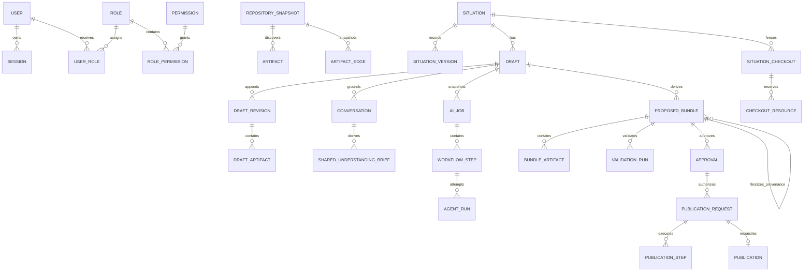

# PostgreSQL data model and migration plan

The reviewed source schema is `packages/db/prisma/schema.prisma`. Application identifiers are UUIDs; all operational time is UTC `timestamptz`; hashes are lowercase SHA-256 hex except Git SHA-1 commit identifiers.

## Database-enforced invariants

The checked-in SQL migration adds constraints Prisma cannot express:

- one unreleased checkout per situation;
- one active ordinary draft per situation;
- one unreleased lock per resource key;
- one running full-review job globally and one active publication per target;
- append-only audit and immutable historical records;
- AI/service identities cannot create approvals;
- normalized username, slug, hash, and checkout-resource shape checks;
- historical foreign keys use `RESTRICT`;
- write roles receive only their explicit table/function grants.

Human approval is bound to repository provenance. Each human account may map
to one unique Leadership `reviewer` identifier. Preparing an AI proposal for
approval creates a new immutable child bundle, writes that identifier and the
review date into every changed public MDX artifact, recalculates all candidate
and canonical hashes, carries open comments forward, reruns exact-byte checks,
and marks the parent bundle stale. The approval records both the Studio user
and repository reviewer identity; staging and the publisher require the
provenance validation as well as the ordinary validation policy.

## Forward migration order

1. pre-migration encrypted dump and free-space/connection check;
2. apply numbered migrations with `situation_studio_migrator`, lock timeout 5 seconds, statement timeout 5 minutes;
3. seed fixed roles/permissions and service identities in one idempotent transaction;
4. run constraint probes and schema compatibility check;
5. start workers compatible with old and new schema;
6. cut over web last.

No web startup runs migrations. Destructive changes use expand/contract across two approved releases. Rollback prefers a forward fix; a migration that cannot coexist with the previous release requires restore-to-new-database rehearsal before rollout.
