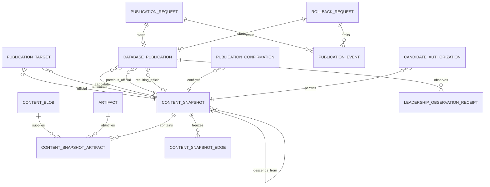
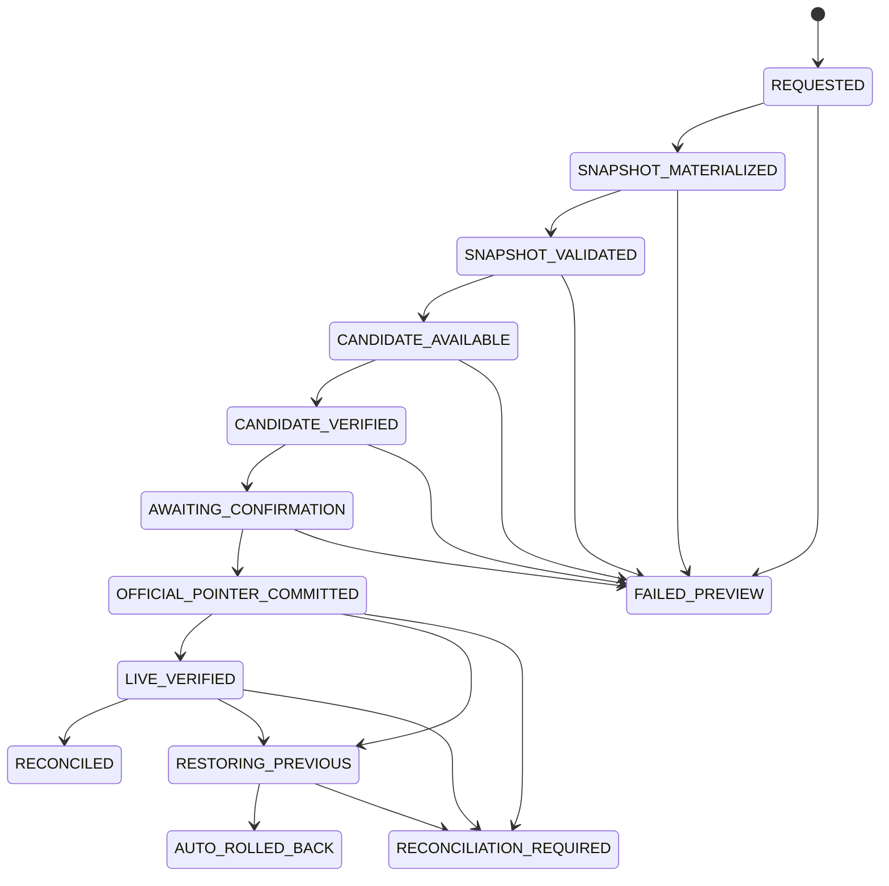

# Database-authoritative publication — Checkpoint 1

Status: implemented and verified locally on 2026-07-19. This is an expand-only
design checkpoint. No production migration, content backfill, reader change,
publication retry, content publication, or deployment was performed.

## Decision record

PostgreSQL is the authority for immutable content snapshots and the protected
Leadership publication target. The target has one official snapshot pointer,
at most one private candidate pointer, and a monotonically increasing fence.
Leadership will read through a server-only database adapter and retain a
hash-verified last-known-good official cache. The cache is an availability
derivative; it never overrides the database pointer while PostgreSQL is
reachable.

“Migrate everything” means every managed content body and graph edge:
situations, guides, practices and quizzes, sources, authors, preparation
prompts and tool definitions, workshop syllabus and lesson plans, supporting
source material, and future artifacts under the approved roots. TypeScript,
React, routes, validators, schemas, and MDX component implementations remain
application code. `lib/tools.ts` is recorded in the frozen legacy inventory,
but its data must be extracted into validated data artifacts at Checkpoint 2;
database content will never execute that module.

Git remains the source-control and application-deployment mechanism. It has no
role in the target content publication, content mirroring, or content rollback
workflow. The existing Git publisher stays active until the later cutover and
decommission approvals; this checkpoint does not alter its runtime behavior.

The accepted recovery objectives are an RPO no greater than five minutes and a
rehearsed RTO no greater than 60 minutes. Production cutover remains blocked
until those targets are achieved by off-host encrypted WAL coverage and a
timed restore rehearsal.

## Starting evidence and cleanup

The repository evidence available at this checkpoint is:

| Evidence                                       | Recorded value                                                     |
| ---------------------------------------------- | ------------------------------------------------------------------ |
| Local Studio source before this change         | `a36b2097722a569c38735ce68d901acbe41037e4`                         |
| Recorded deployed Studio release               | `20260719T094530Z` / `312bf7749a83388f3fe57433d9457efcdce4f743`    |
| Local and recorded protected Leadership commit | `b6e40575eb823dc32c62644775895ad84a80d2d1`                         |
| Recorded Leadership release                    | `ae9f5987-017e-4a80-8c47-c10b5de8b994-b6e40575eb82`                |
| Recorded production database level             | seven migrations, PostgreSQL 16.12                                 |
| Frozen legacy baseline receipt                 | `artifacts/baseline/receipt.json`                                  |
| Frozen legacy manifest hash                    | `a259e603c94c490558f91e420a758114380969aaaa05f8696de8e34c221b000b` |
| Frozen legacy graph hash                       | `cfcc13244698c2a6414b2df9c9541c193e4365a5899fa55dc515e43b00d4abdd` |
| Frozen legacy inventory                        | 29 bodies; graph records 37 nodes and 126 edges                    |

These are repository and prior handoff records, not a fresh production
attestation. Immediately before any production expand migration, operations
must re-read the active Studio/Leadership release markers, query
`_prisma_migrations`, export the complete managed Leadership package, generate
its independent SHA-256 manifest, create a database dump, encrypt it, copy it
off-host, and verify both copies. Any mismatch stops the production checkpoint.

The unfinished stale-Git-baseline recovery experiment was quarantined as the
recoverable Git stash named:

```text
quarantine: stale Git baseline recovery experiment before database publication migration
```

It contains seven paths and 725 changed lines, including the protected-baseline
modules and refresh route. It is absent from the active worktree. No production
request was retried and no content was published during cleanup. The stash is
historical local evidence only and must not be reapplied into this design.

## Schema

The expand migration is
`packages/db/prisma/migrations/20260719150000_database_publication_expand/migration.sql`.
It does not drop, rename, or reinterpret a prior column. Existing
`publications` rows remain immutable Git-era records. They gain only an
optional `content_snapshot_id` for later historical backfill.

New database-native publications use `database_publications`. This separation
keeps the required Git fields on historical rows intact and avoids synthetic
commit values in the new workflow.



### Enforced invariants

- New blobs must match their SHA-256 key and UTF-8 byte length. Existing blobs
  have `NOT VALID` exact-byte constraints so expansion remains compatible;
  Checkpoint 2 validates every pre-existing row before bootstrap.
- Blobs permit only byte-identical no-op updates, preserving current upsert
  compatibility. Any material update or delete fails.
- A snapshot begins `MATERIALIZING`. Its canonical JSON text already has a
  matching manifest hash. Membership and edges can be inserted only inside
  that materialization transaction.
- Finalization to `VALIDATED` recomputes member count, total bytes, blob hashes,
  and blob lengths. A finalized snapshot, member, or edge cannot be updated or
  deleted.
- Each snapshot has unique logical IDs and paths. Snapshot graph foreign keys
  prove that both ends are members of that same snapshot.
- A publication target is created empty and bootstrapped through one fenced
  update to a validated official snapshot. Once bootstrapped, its official
  pointer can never be null.
- Every target mutation increments `generation` by exactly one. A candidate
  cannot replace another candidate. Setting, clearing, promoting, or restoring
  a pointer requires a matching `database_publications` state and evidence.
- An official pointer cannot move while a candidate exists except to promote
  that exact candidate with its exact confirmation. Restoration can select
  only the publication's recorded previous official snapshot.
- A database publication has exactly one ordinary or rollback request. Its
  request, target, base snapshot, publisher identity, bundle, and approval are
  immutable. AI identities cannot be publishers.
- Confirmation is append-only, human-only, within the existing 15-minute
  recent-authentication window, and bound to target generation, candidate UUID,
  candidate hash, request, approval, and validation policy.
- Candidate authorization, events, and observation receipts are append-only
  evidence. Authorization permits only one exchange/revocation progression.
- A `CANDIDATE_VERIFIED`, `LIVE_VERIFIED`, or restored outcome requires a
  matching healthy Leadership observation receipt. A database pointer alone
  cannot establish live verification.
- Event insertion uses a request-row lock and stable event key. It assigns the
  next sequence in the same caller transaction and returns the existing event
  only when retry evidence is byte-equivalent.

The current implementation deliberately leaves full canonical manifest-to-row
equivalence to the pure shared validator at Checkpoint 2. The database proves
hashes, byte lengths, counts, graph membership, and immutability; the shared
contract will prove sorted manifest semantics, approved paths, frontmatter,
JSON schemas, MDX components, and graph meaning.

## State machine

`database_publications.state` uses the durable target states while the old enum
values remain readable for Git-era requests.



Transitions are checked by a trigger, not just application code. Candidate
failure clears the candidate pointer with an unchanged official pointer.
Promotion and its outbox event will run in one serializable transaction.
Post-promotion live failure moves the pointer only to the recorded previous
snapshot. `RECONCILED`, `AUTO_ROLLED_BACK`, and `RECONCILIATION_REQUIRED` each
require their matching terminal outcome.

## Role and grant matrix

Credentials are provisioned outside migrations. The checked-in grant script is
`ops/grant-database-publication-privileges.sql`; it is conditional during the
expand period so application releases can precede credential provisioning.

| Capability                                       | Web                                 | Materializer                                | Leadership reader                            | Operations                | Migrator | AI / legacy publisher           |
| ------------------------------------------------ | ----------------------------------- | ------------------------------------------- | -------------------------------------------- | ------------------------- | -------- | ------------------------------- |
| Read workflow and snapshot metadata              | Yes                                 | Yes                                         | No direct table access                       | Yes                       | Yes      | Limited old workflow only       |
| Read official content bodies                     | Existing internal access            | Yes                                         | Official function only                       | Yes                       | Yes      | AI retains reviewed-input reads |
| Read private candidate bodies                    | Authenticated app flow              | Yes                                         | Candidate function with exact cookie binding | Operational evidence only | Yes      | No                              |
| Create/finalize snapshots                        | No                                  | Yes                                         | No                                           | No                        | Yes      | No                              |
| Move official/candidate pointer                  | No                                  | Yes, trigger fenced                         | No                                           | No direct mutation        | Yes      | No                              |
| Create confirmation                              | Yes, after human/recent-auth checks | No                                          | No                                           | No                        | Yes      | No                              |
| Create observation receipt                       | Yes, after attestation verification | No                                          | No                                           | No                        | Yes      | No                              |
| Append publication event                         | Function only                       | Function only                               | No                                           | Read only                 | Yes      | No                              |
| Read users, sessions, credentials, provider data | Existing web boundary               | No; trigger checks publisher classification | No                                           | No                        | Yes      | Existing narrowly scoped grants |

The Leadership database role has no table privilege at all. It can execute only
the official and candidate batch-read functions. It therefore cannot enumerate
snapshot UUIDs, query arbitrary candidates, read Studio sessions or users, or
mutate a receipt. AI, validator, and legacy Git publisher identities are
explicitly denied the new pointer, confirmation, authorization, event, and
observation tables.

The Leadership process submits signed observations and one-time exchange
requests to narrow Studio endpoints. Studio verifies the attestation and writes
the database row; this preserves the Leadership database identity as read-only.

## Leadership cache contract

Checkpoint 3 will implement this server-only on-disk format:

```text
<cache-root>/v1/
  active-official.json
  snapshots/<manifest-sha256>/
    manifest.json
    graph.json
    artifacts/<content-sha256>
    verified-receipt.json
```

- `manifest.json` contains the exact canonical UTF-8 bytes stored by the
  snapshot. Its directory name and `manifestHash` must equal its SHA-256.
- Every artifact file is named by content hash. Length and SHA-256 are checked
  before the snapshot directory can receive `verified-receipt.json`.
- `graph.json` is a deterministic projection of same-snapshot edges and is
  covered by the canonical manifest contract defined at Checkpoint 2.
- Cache directories are immutable by hash. A temporary directory is created on
  the same filesystem, written with mode `0700/0600`, fully verified, fsynced,
  and atomically renamed to its final hash directory.
- `active-official.json` contains schema version, target code, snapshot UUID,
  snapshot hash, activation time, and verification receipt digest—never a
  candidate token. Activation writes and fsyncs a sibling temporary file,
  renames it atomically, then fsyncs the parent directory.
- Candidate cache entries may exist by hash, but only the official activation
  file is consulted on anonymous/public startup or database outage.
- Startup verifies the activation file, manifest, receipt, all bodies, and
  graph before serving. Corruption makes that entry unusable; it never causes a
  candidate or partial snapshot fallback.
- With PostgreSQL unavailable, the last verified official entry serves with a
  degraded-freshness health result. Publications are disabled. Recovery polling
  uses bounded exponential backoff and loads the authoritative official pointer
  before activating anything newer.

The cache format includes a version directory so a prior application release
can read the frozen pre-cutover package during the observation window.

## Candidate authorization

The authorization is short-lived, audience-bound, revocable, and never placed
in a URL:

1. Studio requires the existing authenticated reviewer session, RBAC, CSRF, and
   recent authentication. It creates 256-bit random exchange and cookie
   secrets, stores only their hashes, and binds them to request, target,
   snapshot UUID/hash, reviewer, Leadership audience, and an expiry of at most
   five minutes.
2. The browser sends the one-time exchange secret to Leadership in an HTTPS
   POST body. Query strings, fragments, analytics, referers, and logs never
   receive it.
3. Leadership submits the exchange hash plus the cookie hash to a narrowly
   authenticated Studio back-channel endpoint. Studio atomically marks the
   unused authorization exchanged; replay, expiry, revocation, identity,
   audience, or candidate-pointer mismatch fails closed.
4. Leadership sets the raw cookie secret in a `Secure`, `HttpOnly`,
   `SameSite=Strict`, host-only cookie with the same short expiry. The database
   read function accepts only its hash plus the bound reviewer and audience.
5. Candidate reads return the full validated candidate in one bounded batch.
   Anonymous reads have no snapshot selector and call only the official
   function.
6. Rejection, expiry, candidate clearing, promotion, or explicit revocation
   causes the candidate function to return no rows. Candidate pages set
   `Cache-Control: private, no-store` and a no-referrer policy.

The exchange and observation endpoints require a separate narrowly scoped
Leadership-to-Studio attestation identity. It can neither query Studio data nor
write arbitrary rows. Key rotation uses key IDs recorded on observation
receipts; secrets are never stored in receipts.

## Expand, migrate, shadow, cut over, contract

1. **Evidence and recovery preflight:** fresh release/migration inventory,
   encrypted local dump, verified off-host copy, frozen content package, host
   capacity checks, and confirmed PITR coverage. No publication retry.
2. **Expand:** apply the additive migration with a five-second lock timeout and
   five-minute statement timeout; apply explicit grants; run schema drift and
   invariant probes. Existing readers and Git publisher remain active.
3. **Migrate:** Checkpoint 2 imports every artifact/edge, extracts embedded tool
   data, validates old blob constraints, and bootstraps—but does not select—the
   content snapshot.
4. **Shadow:** Checkpoint 3 loads database snapshots and cache entries while
   filesystem bytes remain public. No mismatch is silently accepted.
5. **Publisher acceptance:** Checkpoint 4 proves materialization, preview,
   confirmation, observation, crash recovery, restoration, and rollback with
   Git network disabled.
6. **Production shadow and recovery rehearsal:** Checkpoint 5 proves zero
   unexplained mismatch and timed off-host PITR restore.
7. **Cut over:** Checkpoints 6 and 7 require separate approvals for public reads
   and the first database-authoritative publication.
8. **Contract:** only after the observation window and another explicit
   approval, remove the Git content publisher and obsolete current-state
   fields. Historical Git-era records remain.

No down migration is part of this plan. A failed expand receives a forward fix,
or the application remains on its prior compatible release while the database
is restored into a new disposable instance for investigation.

## Backup and PITR plan

The sole-authority cutover requires continuous PostgreSQL recovery, not only a
nightly logical dump.

### Target configuration

- Use one encrypted off-host pgBackRest repository with immutable/versioned
  retention and a key not stored on RP1. Enable `archive_mode=on`, a pgBackRest
  `archive-push` command, and `archive_timeout=60s`. Alert if the last
  successfully archived WAL is more than three minutes old; block publication
  at five minutes.
- Take a weekly full, daily differential, and six-hour incremental physical
  backup with `process-max=1` and bounded compression on RP1. Keep at least two
  complete backup chains and 30 days of WAL. Retention must cover the full
  observation window.
- Keep a daily `pg_dump -Fc situation_studio` as a secondary, portable recovery
  artifact. Encrypt before off-host copy; record ciphertext and plaintext
  checksums, size, PostgreSQL version, migration head, official snapshot UUID
  and hash, WAL position, and copy result.
- Monitor archive age, backup age, repository capacity, last check result, and
  restore-rehearsal age. Any red recovery metric disables new publication but
  does not change Leadership's active cache.
- Run `pgbackrest check` after configuration/key/host changes. Run a monthly
  timed PITR rehearsal and a pre-cutover rehearsal. Restore to a new container,
  volume, port, and database identity—never over production.

`archive_timeout=60s` leaves margin for transfer and alerting under the
five-minute RPO. The owner must confirm repository location, encryption/key
custody, retention cost, and monitoring before production configuration.

### Pre-migration gate

Run these checks read-only before backup or migration:

```sh
uptime
free -h
df -h
docker stats --no-stream
docker exec postgres16 psql -U situation_studio_migrator -d situation_studio \
  -Atc "select version(), pg_is_in_recovery(), current_setting('max_connections');"
docker exec postgres16 psql -U situation_studio_migrator -d situation_studio \
  -Atc "select migration_name, finished_at from _prisma_migrations order by finished_at desc nulls last limit 3;"
```

Stop on low space, memory pressure, abnormal load, database recovery mode,
archive lag, an unfinished migration, an active publication/candidate, or any
unexplained release/content mismatch. The exact thresholds and maintenance
window are approved at Checkpoint 5; no command here restarts an unrelated
service.

### Disposable restore rehearsal

For the logical migration proof, use an explicit disposable database name:

```sh
pg_dump --version
pg_restore --version
pg_dump -Fc --no-owner --no-acl "$SOURCE_DATABASE_URL" > checkpoint1.dump
sha256sum checkpoint1.dump > checkpoint1.dump.sha256
sha256sum --check checkpoint1.dump.sha256
createdb "$DISPOSABLE_DATABASE_NAME"
pg_restore --exit-on-error --no-owner --no-acl \
  --dbname "$DISPOSABLE_DATABASE_URL" checkpoint1.dump
DATABASE_URL="$DISPOSABLE_DATABASE_URL" pnpm verify:database-publication
```

Both backup tools must be from the same PostgreSQL major version as the server.
The local rehearsal intentionally caught and rejected a newer client that
emitted `SET transaction_timeout` for PostgreSQL 16; the successful run used
the PostgreSQL 16.12 `pg_dump` and `pg_restore` binaries from the database
container.

Production uses encrypted files and secret-safe environment/config sources;
credentials do not appear in arguments, documentation, logs, or shell history.
The physical PITR rehearsal restores the selected base backup plus WAL to the
requested timestamp in an isolated PostgreSQL 16 container, then proves:

- `_prisma_migrations` and constraints match source;
- official and candidate pointers, generation, publications, events,
  confirmations, observations, snapshots, edges, and blobs agree;
- every official body hash and byte length verifies;
- the frozen official cache can start independently;
- the application verifier and public/candidate isolation suite pass.

RTO is measured from the declared incident start through verified read-only
availability of Studio recovery data and Leadership's official content. A run
over 60 minutes blocks cutover.

## Rollback and reconciliation runbook

Content rollback never invokes Git, deletes a snapshot, runs a down migration,
or restores production in place.

1. Authenticate an authorized human, require recent authentication, select a
   prior snapshot that has a healthy official observation, provide a reason,
   and create a new idempotent rollback request.
2. Materialize no new bytes: validate the exact selected immutable snapshot,
   expose it as the sole private candidate, and obtain a new candidate
   observation and exact confirmation.
3. In one serializable transaction, verify target generation and confirmation,
   advance the official pointer to that snapshot, increment the fence, and
   append the event.
4. Require a healthy official observation for that hash before reconciliation.
   The rollback is a new audited database publication; later snapshots remain
   intact and selectable through history.
5. If live verification fails after any promotion, set the same publication to
   `RESTORING_PREVIOUS` and atomically restore its recorded previous official
   snapshot. Mark `AUTO_ROLLED_BACK` only after a healthy restoration receipt.
6. If restoration cannot be proved, enter `RECONCILIATION_REQUIRED`. Freeze
   publication and report target pointer, Leadership observation, cache hash,
   and exactly one action: restore Leadership from the frozen verified official
   cache while operations investigate. Do not guess or retry publication.

Application rollback during the expand/shadow phases repoints only Studio or
Leadership to the prior schema-compatible application release. The additive
schema stays. After database-reader cutover, the approved abort path activates
the frozen, hash-verified cache package; it does not change database history or
use Git publication.

## Checkpoint 1 verification

The top-level partial verifier is:

```sh
DATABASE_URL="$DISPOSABLE_DATABASE_URL" pnpm verify:database-publication
```

It currently proves schema validity and drift, exact blob rejection, snapshot
and graph immutability, target bootstrap/fencing, official/candidate isolation,
event idempotency/replay, exact confirmation, observation evidence, atomic
pointer promotion, and the role matrix. Checkpoints 2–4 extend the same command
with inventory, shared contracts, readers, browser isolation, concurrency, and
fault injection.

Checkpoint 1 is not approval to change an application reader. The next decision
is whether to proceed with Checkpoint 2: complete backfill and shared
validation.

### Recorded disposable evidence

- Fresh PostgreSQL 16.12 migration: eight migrations applied successfully.
- Prisma database-to-schema drift check: no difference detected.
- Invariant and grant verifier: all snapshot, pointer, event, confirmation,
  observation, isolation, and privilege probes passed.
- Version-matched custom dump: 254,025 bytes, SHA-256
  `97bc79d7cd5e0c89009eb8f4101f47ee62532da51846b0c720494a13db9c214e`.
- Restore target: new disposable
  `situation_studio_migration_test_checkpoint1_restore` database.
- Post-restore verifier: passed; post-restore drift check: no difference.

This is a logical restore proof for the expand migration, not the required
production off-host WAL/PITR rehearsal. PITR and the 60-minute RTO remain open
production gates.
