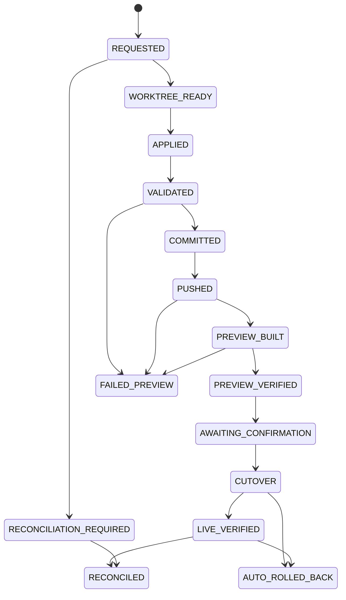

# Publication saga and crash contract

Only a trusted publisher can advance an immutable approved bundle. AI output can never call this boundary.

Every step has a unique logical identity, attempt, fence, input/output hash, and external ID. The Git commit contains the publication UUID and bundle/base hashes as trailers. The release marker contains the same UUID and commit. A retry discovers these identifiers before creating an external side effect.

The crash harness injects termination before and after worktree creation, apply, validation, commit, push, build, preview registration, preview health, final confirmation, cutover, public health, and database finalization. It asserts at most one candidate commit, one logical publication, and one cutover; pre-cutover failures leave public unchanged; post-cutover database failure reconciles from the marker; post-cutover health failure restores the recorded previous release.

Force push and destructive history rewriting are never recovery operations. A rollback is a new audited publication whose tree matches a prior verified release.
