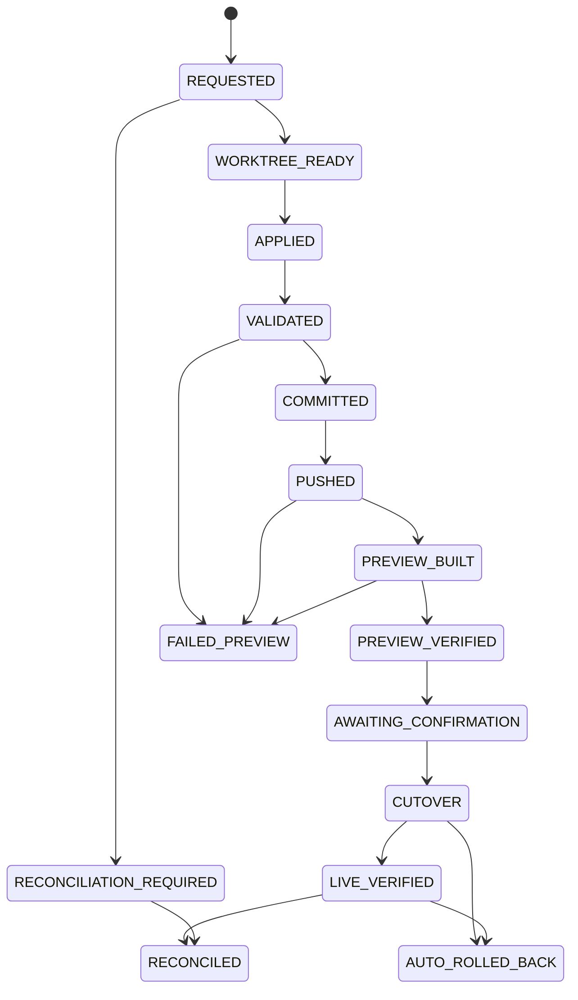

# Publication saga and crash contract

Only a trusted publisher can advance an immutable approved bundle. AI output can never call this boundary.

Every step has a unique logical identity, attempt, fence, input/output hash, and external ID. The Git commit contains the publication UUID and bundle/base hashes as trailers. The release marker contains the same UUID and commit. A retry discovers these identifiers before creating an external side effect. The historical `PREVIEW_*` state names mean pre-publication candidate build and verification; both use the single `leadership.timsprototypes.com` runtime. There is no second preview hostname or process.

The crash harness injects termination before and after worktree creation, apply, validation, commit, push, candidate activation, candidate health, final confirmation, Git finalization, public health, and database finalization. It asserts at most one candidate commit and one logical publication. Before final confirmation, protected Git `main` stays unchanged even though the prototype Leadership runtime shows the candidate. After final confirmation, a database failure reconciles from the marker; a health failure restores the recorded previous release.

Force push and destructive history rewriting are never recovery operations. A rollback is a new audited publication whose tree matches a prior verified release.
